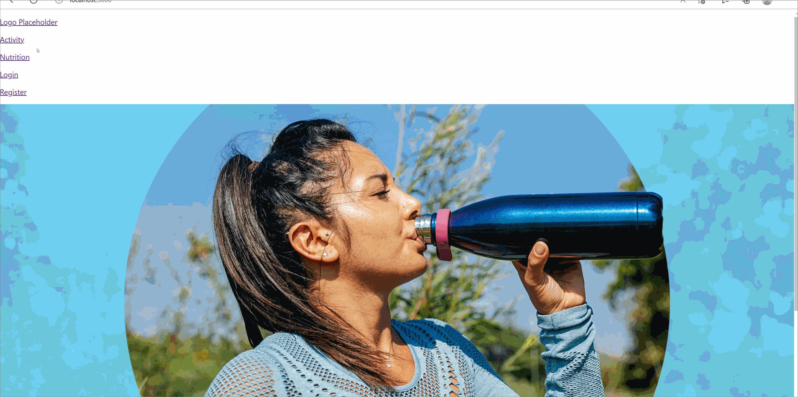

# Week 3 Assignment: Life Tracker

Submitted by: **Winson Chen**

Deployed Application: [Lifetracker Deployed Site](ADD_LINK_HERE)

## Application Features

### Core Features

- [X] **The Nav Bar:** Implement customized views for users who are logged in vs not logged in.
  - [X] If the user is logged in, it should display a **Sign Out** button. 
  - [X] If no user is logged in, it should display **Login** and **Register** buttons
  - [X] Display a logo on the far left side, and contain links to the individual detailed activity page. 
- [X] **The Landing Page:** Display a large hero image and a brief blurb on what this application is about
- [X] **Login Page:** A form that allows users to login with email and password.
- [X] **Registration Page:** A form that allows the user to sign up with their email, password, username, first name, and last name.
- [X] When a user first authenticates, they should be redirected to an authenticated view (i.e the detailed activity page). When they sign out, all frontend data should be reset.
- [ ] Users have access to an overview Activity page that show one summary statistic about each of the 3 types of activity tracked.
- [X] The API should have a `security` middleware that only allows authenticated users to access resources and only allows users to access resources about themselves. 
- [X] Users should have the ability to track at least **1** types of activities (i.e Nutrition, Exercise, Sleep, etc.). Each activity should be tracked on separate pages.
- [ ] Deployed website with Heroku & Surge. 

**Detailed Activity Page:**
- [ ] The detailed activity page should display a feed of all previous tracked activities.
- [ ] The detailed activity should contain a form to contain relevant information. (i.e if tracking nutrition this form allows the user to capture calories, timestamp, image, category, etc.) 
- [ ] The activity tracked should be given a unique id for easy lookup.
  `TODO://` Add link to table schema in the link code below. Your file should end in `.sql` and show your schema for the detailed activities table. (🚫 Remove this paragraph after adding schema link)
  * [Table Schema](📝ADD LINK TO TABLE SCHEMA.sql HERE!) 

### Stretch Features

Implement any of the following features to improve the application:
- [ ] Each model (`nutrition`, `exercise`, and `sleep`) should also implement a `fetchById` method that queries the database for a record by its id and only serves it to users who own that resource. Create a new dynamic route on the frontend that displays detail about a single record. For instance, `nutrition/detail/:id` should show a page with all the information about a single nutrition item.
- [ ] Provide a dropdown that allows users to filter activity based on a certain attribute of any activity item.
- [ ] Calculate aggregate statistics based on time periods - such as daily, weekly, monthly aggregates.
- [ ] Create a page that shows all other users that use the life tracker application and allow users to follow each other.

### Walkthrough Video

`ADD_EMBEDDED_CODE_HERE`

### Reflection

* Did the topics discussed in your labs prepare you to complete the assignment? Be specific, which features in your weekly assignment did you feel unprepared to complete?

The topics discussed in lab did not really prepare me for the assignment. I felt prepared for the SQL and React portions. However, there were some topics such as the security middleware, JWT, and the Contexts that I did not feel prepared to complete.

* If you had more time, what would you have done differently? Would you have added additional features? Changed the way your project responded to a particular event, etc.
  
If I had more time, I would probably have completed more of the front end and tried to connect that with the backend.

* Reflect on your project demo, what went well? Were there things that maybe didn't go as planned? Did you notice something that your peer did that you would like to try next time?

The backend of the project went well, and I am glad that I was able to set up the API and databases. However, I initially panicked because there were some topics that we did not learn about yet that we had to implement. This caused me to lose time becasue I was unsure where to begin. Next time, I will try to focus more on the parts that I do know how to do and try to finish them first.

### Open-source libraries used

- Add any links to open-source libraries used in your project.

### Shout out

Give a shout out to somebody from your cohort that especially helped you during your project. This can be a fellow peer, instructor, TA, mentor, etc.

[Add your response here]
